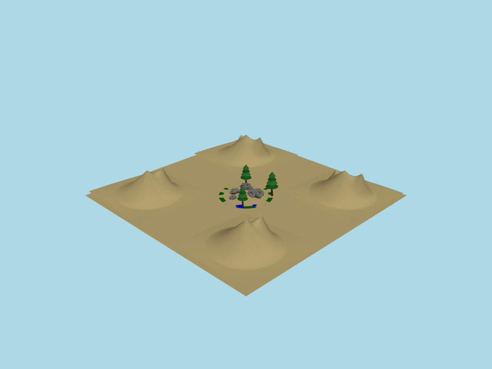
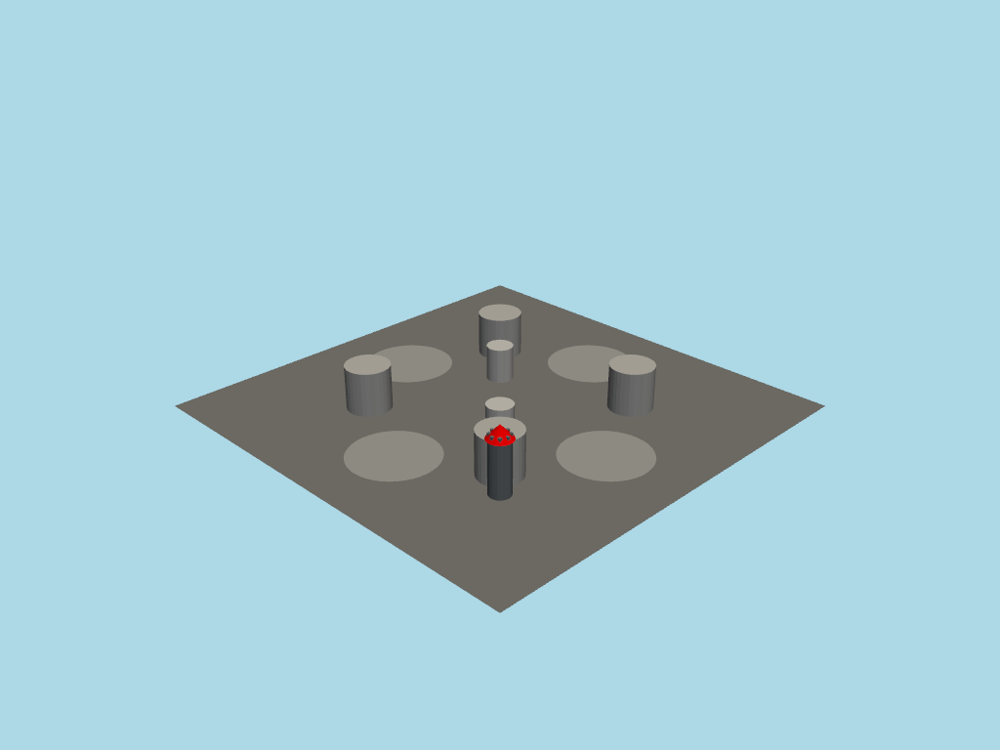
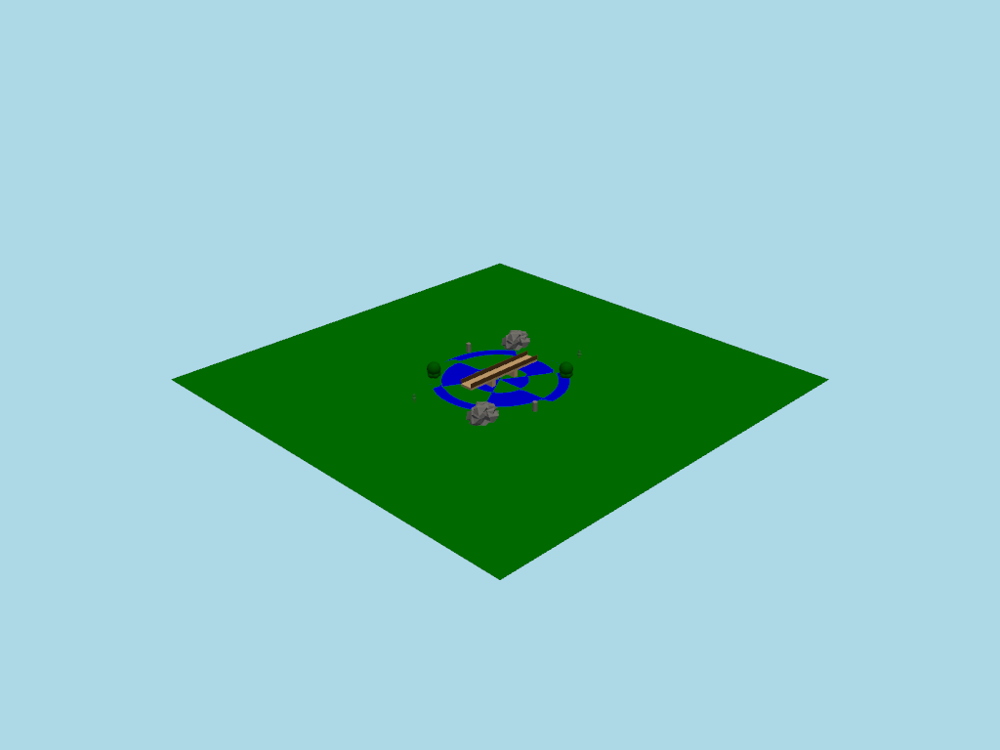
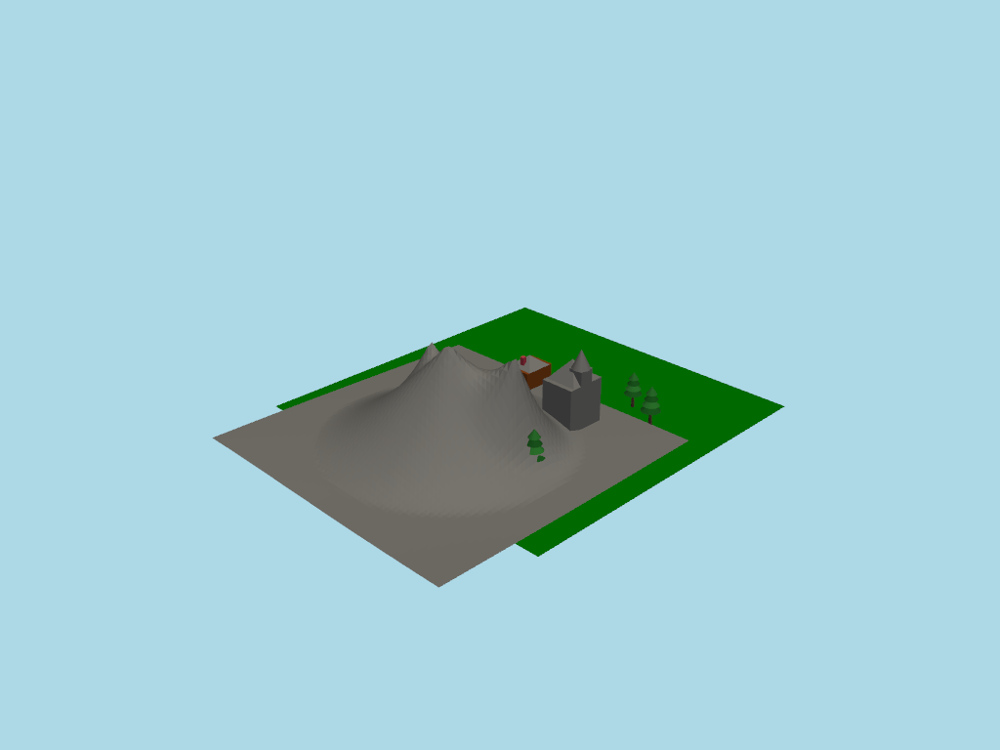
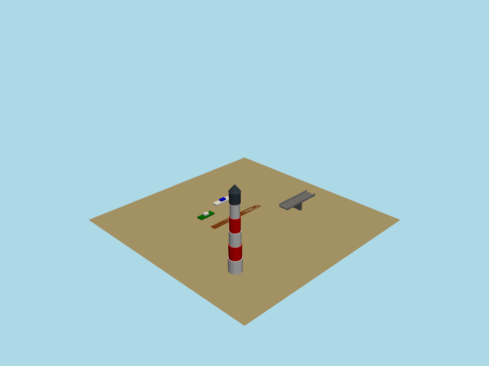

# 🏗️ Text-to-3D Scene Generator

Generate 3D scenes from natural language using a **three-stage architecture with feedback loop**.


## Architecture

```
User Prompt → [Stage 1: LLM] → Entities → [Stage 2: Rules] → Render → Image
                    ↑                                                   ↓
                    └─────────────── [Stage 3: Vision Critic] ←─────────┘
```

| Stage | Component | Role |
|-------|-----------|------|
| 1 | GPT-4o (LLM) | Scene understanding → high-level entities with parameters |
| 2 | EntityAgent (Rules) | **Deterministic** decomposition → geometric primitives (no LLM) |
| 3 | Vision Critic (LLM) | Analyze rendered image → score & feedback → refinement loop |

**Why three stages?**
- **Stage 1**: LLM focuses on *what* to create, not *how* to build it
- **Stage 2**: Entity decomposition is **deterministic** — no LLM calls, just rules
- **Stage 3**: Vision model validates output and triggers automatic refinement
- Self-improving pipeline that iterates until quality target is met

## Examples

### Desert Oasis
```
"a desert oasis with palm trees, a small pond, and scattered rocks surrounded by sand dunes"
```


### Space Station
```
"a futuristic space station platform with cylindrical modules, a communication tower, and landing pads"
```


### Japanese Garden
```
"a serene Japanese garden with a small bridge over a pond, stone lanterns, and bonsai trees"
```


### Mountain Village
```
"a small mountain village with wooden cabins, a church, and pine trees on a hillside"
```


### Coastal Harbor
```
"a coastal harbor with a lighthouse, wooden pier, boats, and a stone bridge"
```


## Quick Start

```bash
# Clone and setup
git clone https://github.com/yourusername/super-sniffle.git
cd super-sniffle
python -m venv .venv
source .venv/bin/activate
pip install -r requirements.txt

# Set your OpenAI API key
echo "OPENAI_API_KEY=sk-your-key" > .env

# Run
python main_v2.py
```

## Commands

| Command | Description |
|---------|-------------|
| `[prompt]` | Generate scene with auto-refinement (keeps best score) |
| `/norefine` | Disable feedback loop for next prompt |
| `/refine` | Enable feedback loop (default) |
| `/iterations N` | Set max refinement iterations (default: 5) |
| `quit` | Exit |

## Feedback Loop

The Vision Critic (Stage 3) uses GPT-4o's vision capability to:

1. **Analyze** the rendered scene image
2. **Score** quality from 1-10
3. **Identify issues**: missing elements, positioning, scale, color, composition
4. **Generate fixes**: JSON patches for the scene
5. **Trigger refinement** if score < 8

The loop continues until the target score is reached or max iterations hit.

## Feedback Loop Test Results

We tested 5 diverse prompts through the feedback loop to evaluate the system's ability to iteratively improve scene generation. **The system keeps the best-scoring scene across all iterations.**

### Test Summary

| # | Scene | Initial | Best | Best Iter | Iterations | Meshes | Screenshot |
|---|-------|---------|------|-----------|------------|--------|------------|
| 1 | Desert Oasis | 4/10 | 5/10 | 2 | 3 | 37 |  |
| 2 | Space Station | 6/10 | 6/10 | 1 | 3 | 9 |  |
| 3 | Japanese Garden | 5/10 | 5/10 | 1 | 3 | 33 |  |
| 4 | Mountain Village | 5/10 | 5/10 | 1 | 3 | 55 |  |
| 5 | Coastal Harbor | 5/10 | 5/10 | 1 | 3 | 19 |  |

**Key: Best Iter** = Iteration with highest score (system returns this scene)

### Detailed Iteration Analysis

<details>
<summary><b>Desert Oasis</b> - Score improved: 4 → 5 (kept iteration 2)</summary>

**Prompt:** `a desert oasis with palm trees, a small pond, and scattered rocks surrounded by sand dunes`

| Iteration | Entities | Meshes | Score | Result |
|-----------|----------|--------|-------|--------|
| 1 | 9 | 28 | 4/10 | Pond missing, trees clustered, scene sparse |
| 2 | 9 | 37 | **5/10** | ★ Best - Improved with pond and better layout |
| 3 | 10 | 38 | 5/10 | Similar score, iteration 2 kept |

**Critic Feedback:**
- "The pond is missing from the scene"
- "The palm trees are positioned too close together"
- "The scene appears too sparse with emphasis on empty space"


</details>

<details>
<summary><b>Space Station</b> - Best at iteration 1 (later iterations didn't improve)</summary>

**Prompt:** `a futuristic space station platform with cylindrical modules, a communication tower, and landing pads`

| Iteration | Entities | Meshes | Score | Result |
|-----------|----------|--------|-------|--------|
| 1 | 7 | 9 | **6/10** | ★ Best - Basic layout established |
| 2 | 9 | 19 | 6/10 | Tower floating, landing pad overlaps |
| 3 | 12 | 19 | 6/10 | No improvement, iteration 1 returned |

**Critic Feedback:**
- "The scene looks sparse, elements too spread out"
- "Colors of cylinders and platform blend too much"
- "Landing pad on edge of platform seems unbalanced"


</details>

<details>
<summary><b>Japanese Garden</b> - Best at iteration 1</summary>

**Prompt:** `a serene Japanese garden with a small bridge over a pond, stone lanterns, and bonsai trees`

| Iteration | Entities | Meshes | Score | Result |
|-----------|----------|--------|-------|--------|
| 1 | 10 | 33 | **5/10** | ★ Best - Bridge and pond present |
| 2 | 14 | 51 | 5/10 | More elements but same score |
| 3 | 19 | 93 | 5/10 | Many meshes but quality unchanged |

**Critic Feedback:**
- "Bonsai trees are missing from the scene"
- "Stone lanterns are not visible"
- "The scene feels too sparse and empty"


</details>

<details>
<summary><b>Mountain Village</b> - Score dropped but best kept (5 → 3 → 3, returned 5)</summary>

**Prompt:** `a small mountain village with wooden cabins, a church, and pine trees on a hillside`

| Iteration | Entities | Meshes | Score | Result |
|-----------|----------|--------|-------|--------|
| 1 | 8 | 55 | **5/10** | ★ Best - Village with cabins and church |
| 2 | 12 | 95 | 3/10 | ⚠️ Score dropped - cabins missing! |
| 3 | 10 | 75 | 3/10 | Still low, iteration 1 returned |

**Critic Feedback:**
- "Village on flat plane rather than hillside"
- "Mountain base very small compared to village"
- Iteration 2: "Wooden cabins and church are missing" (regression!)


</details>

<details>
<summary><b>Coastal Harbor</b> - Consistent score across iterations</summary>

**Prompt:** `a coastal harbor with a lighthouse, wooden pier, boats, and a stone bridge`

| Iteration | Entities | Meshes | Score | Result |
|-----------|----------|--------|-------|--------|
| 1 | 5 | 19 | **5/10** | ★ Best - All elements present |
| 2 | 5 | 19 | 5/10 | Boats still on pier not water |
| 3 | 6 | 22 | 5/10 | Consistent, iteration 1 returned |

**Critic Feedback:**
- "Boats are located on pier rather than in water"
- "Ground is green, doesn't resemble water body"
- "Stone bridge scale too small relative to lighthouse"


</details>

### Key Observations

1. **Best Score Preservation**: The system now keeps the highest-scoring scene across iterations. Mountain Village showed this clearly: scores went 5→3→3, but iteration 1 (score 5) was returned.

2. **Issue Categories Detected** (from 5 test scenes):
   | Issue Type | Count | Description |
   |------------|-------|-------------|
   | Position | 15 | Objects floating, overlapping, or misplaced |
   | Missing | 12 | Elements from prompt not rendered |
   | Composition | 10 | Layout too sparse or unbalanced |
   | Scale | 5 | Size mismatches between objects |
   | Color | 4 | Colors not matching expectations |

3. **Iteration Patterns**: 
   - Desert Oasis improved (4→5) and kept iteration 2
   - 4/5 scenes had best score at iteration 1
   - Later iterations sometimes regress (Mountain Village: 5→3)

4. **Limitations Observed**:
   - Some specialized entities (bonsai, stone lanterns) lack decomposition rules
   - Z-positioning (floating objects) is a recurring challenge
   - Color naming inconsistencies (e.g., "sandy brown" not recognized)

## Supported Entities

<details>
<summary><b>Buildings</b></summary>

- `house` - width, height, style (simple/modern), wall_color, roof_color
- `tower` - radius, height, battlements
- `castle` - width, depth, wall_height, tower_height
- `church` - width, depth, tower_height
- `lighthouse` - height, stripes, stripe_color

</details>

<details>
<summary><b>Nature</b></summary>

- `tree` - height, crown_style (natural/cone/sphere/layered)
- `bush` - radius, color
- `rock` - size, color (organic mesh with noise)
- `mountain` - base_radius, height, peaks (heightmap terrain)
- `pond` - radius (water surface with waves)
- `water` - width, depth

</details>

<details>
<summary><b>Objects</b></summary>

- `fountain` - radius, height, water_color
- `bench` - length, color
- `lamp_post` - height, light_color
- `bridge` - length, width, pillars
- `car` - length, body_color
- `boat` - length, hull_color

</details>

## How It Works

### Stage 1: LLM Scene Understanding
The LLM receives a prompt and outputs structured JSON with semantic entities:

```json
{
  "scene_description": "A small park with a pond",
  "ground": {"type": "plane", "width": 50, "color": "darkgreen"},
  "entities": [
    {"type": "pond", "radius": 8, "center": [0, 0, 0]},
    {"type": "tree", "height": 10, "center": [-15, 5, 0]},
    {"type": "bench", "length": 3, "center": [10, -5, 0]}
  ]
}
```

### Stage 2: Entity Decomposition
The `EntityAgent` converts each entity to primitives:

```python
# "house" entity becomes:
[
  {"type": "box", ...},      # walls
  {"type": "pyramid", ...},  # roof
  {"type": "box", ...},      # door
  {"type": "box", ...},      # windows
  {"type": "box", ...}       # chimney
]
```

### Hybrid Rendering
- **Terrain**: Heightmap with Perlin-like noise
- **Buildings**: Clean geometric primitives
- **Nature**: Organic procedural meshes (deformed icospheres, clustered spheres)

## Adding New Entities

```python
# In EntityAgent class:
@staticmethod
def _decompose_windmill(entity: dict) -> list:
    center = entity.get("center", [0, 0, 0])
    height = entity.get("height", 15)
    
    return [
        {"type": "cylinder", "radius": 2, "height": height, "center": center},
        {"type": "box", "width": 12, "height": 1, "depth": 0.5, 
         "center": [center[0], center[1], center[2] + height], "rotation": {"z": 45}}
    ]
```

## Tech Stack

- **OpenAI GPT-4o** - Scene understanding
- **PyVista** - 3D rendering
- **NumPy** - Procedural geometry

## License

MIT

---

*Built with curiosity and lots of `plotter.show()` calls* 🎨